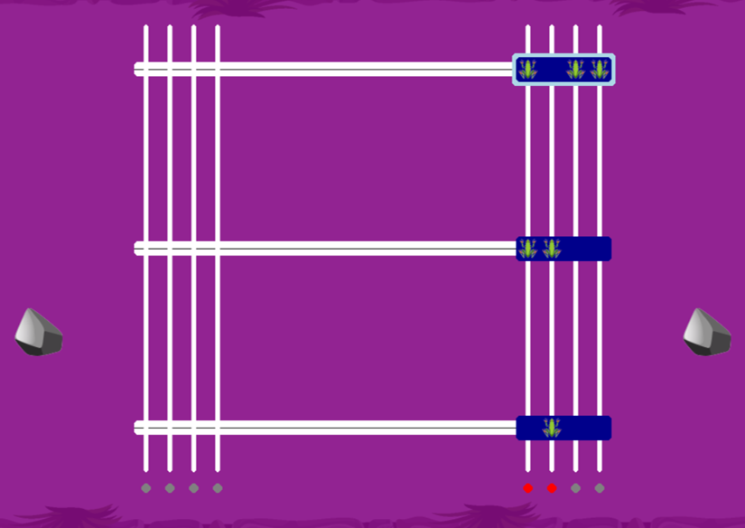

# Cerro de las Tres Esmeraldas – A **Pygame** River‑Crossing Puzzle

> **“Only those who balance light and silence may walk the hidden path.”**
> *Tayrona inscription, City of the Lost*

This small Python game recreates (and re‑skins) the classic **Quarrasi Lock** puzzle from Allen B. Downey’s *Think Like a Programmer*—but relocates the action to the mist‑shrouded **Sierra Nevada de Santa Marta** in Colombia.

We were inspired both by Downey’s book **and** by **Daniel Tam’s** JavaScript adaptation ([danielthetam/TheQuarrasiLock](https://github.com/danielthetam/TheQuarrasiLock)). Our goal is to provide a desktop variant built with **Pygame** that teachers and puzzle lovers can run completely offline.

---

## Story in a Nutshell

Three ceremonial bars—**Trinos**—inlaid with emerald‑frog gemstones must be slid from the **Right Altar** to the **Left Altar**.

* A light niche turns **ON** when its column holds an **even** number of emeralds.
* A conch horn (the alarm) sounds if an altar ever shows **exactly one** lit niche.
* Pressing a stone **chaguala** silences the horn on the altar you are standing next to, but you can press **only one** chaguala at a time.

Move all three Trinos left without waking the spirits!

---

## Play Now

Play directly in your browser: **[Click here to play](URL_TO_YOUR_GAME)**.

---

## Controls

* **Mouse:** Click a bar to move to it, or click the side stones to activate suppressors.
* **Spacebar:** Hold to keep the current altar’s suppressor active.
* **Enter:** Push the focused bar.
* **R:** Reset the puzzle.
* **M:** Mute/unmute the soundtrack.
* **+ / –:** Raise or lower the volume.

---

## How to Play

1. The goal is to move all three bars to the left without triggering an alarm incorrectly.
2. Use the green suppressor stones to prevent a misstep.
3. Enjoy the atmosphere and solve the puzzle!

---

## Credits

* Original puzzle by **Allen B. Downey**, *Think Like a Programmer* (Chapter 1).
* JavaScript inspiration by **Daniel Tam** – [https://github.com/danielthetam/TheQuarrasiLock](https://github.com/danielthetam/TheQuarrasiLock).
* Emerald‑frog icon © Ana Salazar (CC BY 4.0).
* Background music loop by **Kevin MacLeod** (CC0).

---

## License

MIT – See [`LICENSE.md`](LICENSE.md).

Happy puzzling, and may the spirits of the Sierra guide your moves!
